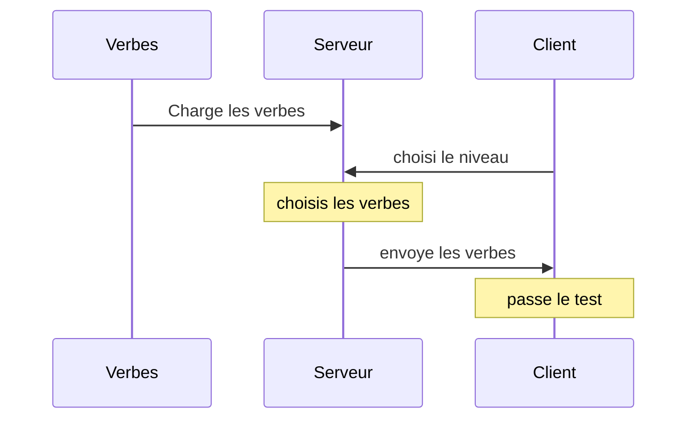

# Verbes-Irrélguliers


**Site web qui permet d'interroger un utilisateur sur 10 verbes irréguliers.**


# 🛠️ Installation

Pour installer l'application sur votre machine, il suffit de télécharger en zip le code, d'installer la librairie de serveur python Flask dans le terminal avec la commande `pip install Flask`.
Pour démarrer le serveur, il faut exécuter le fichier `server.py`. Pour voir le site, rendez-vous à l'adresse [127.0.0.1:5000](127.0.0.1:5000) dans votre navigateur.

Sinon, vous pouvez utiliser l'application directement dans votre navigateur en vous rendant à l'adresse **[verbes-irreguliers.vercel.app ↗️](https://verbes-irreguliers.vercel.app/)**


# 🎯 Objectifs

Nous avons voulu faire le projet sous forme de site internet pour avoir une interface utilisateur agréable et très facile d'utilisation, qui requiert très peu de connaissances en informatique. Au contraire, le terminal est plus complexe à utiliser et à manipuler.

Ce choix a aussi un but de facilité, car pour utiliser notre projet, il suffit de se rendre sur le site internet, il n'y a donc pas besoin de l'installer, d'avoir déjà python installé sur la machine, de l'exécuter...

Une interface web permet aussi de garder les listes des verbes du côté serveur et éviter que l'utilisateur y ait accès.

Afin d'aider à apprendre les verbes, nous avons ajouté une fonctionnalité qui permet de lire à voix haute les verbes en anglais. Cela permet d'apprendre la prononciation et permet de mieux les retenir. Cette fonctionnalité repose sur la [Web Speech API](https://developer.mozilla.org/fr/docs/Web/API/Web_Speech_API) présente dans les principaux navigateurs, compatible avec la majorité de ceux-ci.


# ⚙️ Fonctionement

Utilise un serveur en python reposant sur la librairie Flask, et sur du javascript pour le côté client.

Voici l'organisation du code:

 - Les verbes irréguliers sont stockés dans des fichiers `csv` dans le dossier `verbes`.

 - Les pages html sont stockées dans le dossier `templates`.

 - Les ressources web (images, css, js...) sont stockées dans le dossier `static`.




L'utilisateur chosit le niveau (le fichier de verbe a utiliser) et est redirigé vers la page web correspondant.


# 💡 Problèmes rencontrés

## Protection des réponses
Quand la liste de verbes est envoyée au client pour faire le test, elle apparaît clairement dans le code source de la page, il était donc très facile de tricher et de s'en servir.

Pour régler le problème, nous avons décidé de crypter les réponses envoyées et de les décrypter quand le programme a besoin de les utiliser. 

Nous avons donc utilisé la technique de cryptage `Xor`, qui a été implémentée sur le serveur en python pour le cryptage des réponses et en javascript du côté client pour les décrypter.

Nous n'avons pas directement décrypté la liste en entier du côté client car sinon elle aurait directement été accessible via la console javascript du navigateur.

Voici un morceau de liste avant/après encryption:


```js
["répandre", "spread", "spread", "spread"]
```

devient: 

```js
["\u0013¤\u0005''\u0006\u0016R", "\u0012=\u0007#(\u0006", "\u0012=\u0007#(\u0006", "\u0012=\u0007#(\u0006"]
```

## Les verbes qui ont plusieurs formes

Certains verbes peuvent s'ecrire de  différantes façons, comme par example be: was/where ou dream: dreamt/dreamed

Pour permetre a l'utilisateur de valider la réponse si un des 2 est rentré, nous avons du ajouter un systeme de conditions pour verifier la précence du caratère séparateur dans la réponse (`"/"`), de faire une liste de réponses valides a partire de la réponce initiale et finalement de vérifier si la réponce de l'utilisateur est présente dans cette nouvelle liste.

## Eviter la triche
Pour éviter que l'utilisateur triche et regarde les réponses sur internet, nous avons ajouté une fonctionnalité qui permet de détecter les changements de page lors du test. Quand cet événement se produit, le test s'arrête et demande a l'utilisateur de retourner à la page d'accueil