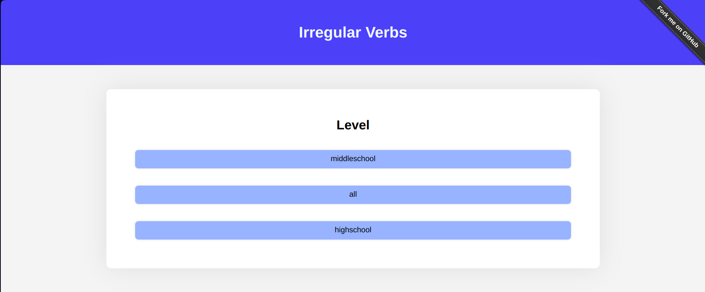

# Verbes-Irrélguliers


**Site web qui permet d'interoger un utilisateur sur 10 verbes irréguliers.**





# 🛠️ Instalation

Pour installer l'application sur votre machine, il suffit de telecharger en zip le code, installer la librairie de serveur python Flask dans le terminal avec la commande `pip install Flask`.
Pour démarer le serveur, il faut executer lancer le fichier `server.py`. Pour voir le site, rendez vous a l'adresse [27.0.0.1:5000](27.0.0.1:5000) dans votre navigateur.

Sinon, vous pouvez utiliser l'application directement dans voter navigateur en vous rendant a l'adresse **<a href="https://verbes-irrelguliers.vercel.app/" target="_blank">verbes-irrelguliers.vercel.app ↗️</a>**


# 🎯 Objectifs

Nous avons voulue faire le projet sous forme de site internet pour avoir une interface utilisateur agréable et très facile d'utilisation, qui requière très peu de connaisances en informatique. Au contraire, le terminal est plus complexe a utiliser et a manipuler.

Se choix a aussi un but de facilité, car pour utiliser notre projet, il suffit de se rendre sur le site internet, il n'y a donc pas besoin de l'installer, d'avoir deja python d'intallé sur la machine, de l'executer...

Une interface web permet aussi de garder les listes des verbes du coté serveur et éviter que l'utilisateur y ai accès.

Afin d'aider à apprendre les verbes, nous avons ajouté une fonctionnalitée qui permet de lire a voix haute les verbes en anglais. Cela permet d'apprendre la pronionciation et permet de mieux les retenir. Cette fonctionnalité repose sur la [Web Speech API](https://developer.mozilla.org/fr/docs/Web/API/Web_Speech_API) presente dans les principaux navigateurs, compatible avec la majoritée de ceux-ci.


# ⚙️ Fonctionement

Utilise un serveur en python reposant sur la libraire Flask, et sur du javascript pour le coté client.

Voici l'organisation du code:

 - Les verbes irréguliers sont stockées dans des fichiers `csv` dans le dossier `verbes`.

 - Les pages html sont stockées dans le dossier `templates`.

 - Les ressources web (images, css, js...) sont stockés dans le dossier `static`.

L'utilisateur chosit le niveau (le fichier de verbe a utiliser) et est redirigé vers la page web correspondant.


# 💡 Problèmes rencontrés

## Protection des réponses
Quand la liste de verbe est envoyée au client pour faire le teste, elle aparait clairement dans le code source de la page, il était donc très facile de tricher et de s'en servir.

Pour regler le problème, nous avons décidé de crypter les réponces envoyées et de les décrypter quand le programme a besoin de les utiliser. 

Nous avons donc utilisé la technique de cryptage `Xor`, qui a été implementée sur le serveur en python pour le cryptage des réponses et en javascript du coté client pour les décrypter.

Nous n'avons pas dirrectement décrypter la lsite en entier du coté client car sinon elle aurait dirrectement été accesible via la console javascript du navigateur.

Voici un morceau liste avant/après enctyption:


```js
["répandre", "spread", "spread", "spread"]
```

devient: 

```js
["\u0013¤\u0005''\u0006\u0016R", "\u0012=\u0007#(\u0006", "\u0012=\u0007#(\u0006", "\u0012=\u0007#(\u0006"]
```

## Les verbes qui ont plusieurs formes

Certains verbes peuvent s'ecrire de  différantes façons, comme par example be: was/where ou dream: dreamt/dreamed

Pour permetre a l'utilisateur de valider la réponse si un des 2 est rentré, nous avons du ajouter un systeme de conditions pour verifier la précence du caratère séparateur dans la réponse (`"/"`), de faire une liste de réponses valides a partire de la réponce initiale et finalement de vérifier si la réponce de l'utilisateur est présente dans cette nouvelle liste. 